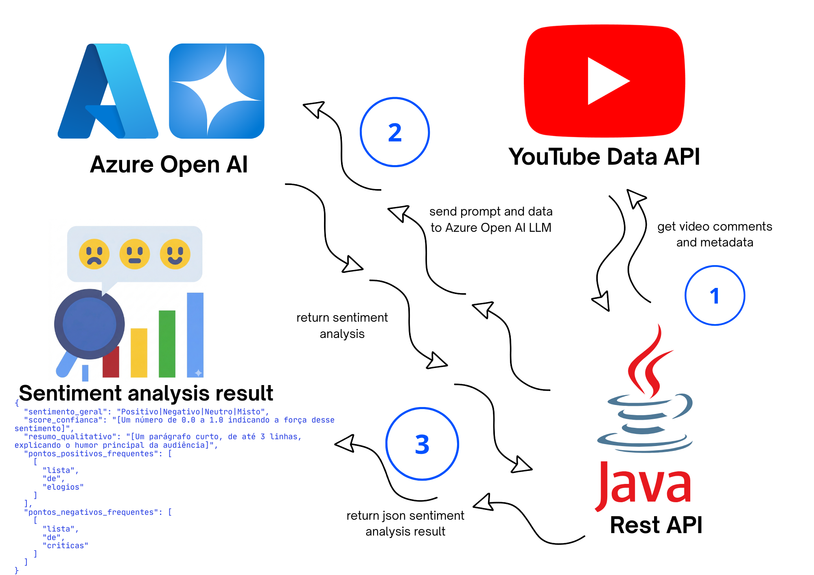

# youtube-comment-sentiment-ai

## High Level Architecture

Esta arquitetura descreve o fluxo de coleta, processamento e análise de sentimento de comentários de vídeos do YouTube utilizando uma **API REST em Java** integrada ao **YouTube Data API** e ao **Azure OpenAI**.

### 1. Coleta de dados do YouTube

A **Java REST API** é responsável por integrar com o **YouTube Data API** para coletar informações do vídeo, incluindo:

* Comentários dos usuários
* Metadados do vídeo
* Informações relevantes para análise

Esses dados são obtidos programaticamente e organizados pela aplicação para posterior processamento.

### 2. Processamento com Azure OpenAI

Após a coleta, a aplicação envia os comentários e um **prompt estruturado** para o **Azure OpenAI LLM**.

O modelo processa os comentários e realiza uma **análise de sentimento**, avaliando o humor geral da audiência e identificando padrões nos comentários.

O resultado retornado pelo modelo inclui, por exemplo:

* **sentimento_geral** (positivo, negativo, neutro ou misto)
* **score_confiança** indicando a intensidade do sentimento
* **resumo_qualitativo** descrevendo o humor geral da audiência
* **pontos_positivos_frequentes**
* **pontos_negativos_frequentes**

### 3. Retorno do resultado

O **Azure OpenAI** retorna o resultado da análise para a **Java REST API** em formato estruturado.

A API então:

* consolida os resultados
* retorna um **JSON de análise de sentimento**
* disponibiliza os dados para consumo por outros serviços ou interfaces.

### Resultado final

O sistema gera um **relatório estruturado de sentimento da audiência**, permitindo entender rapidamente a percepção do público sobre um vídeo do YouTube.

---

### Status do desenvolvimento

🚧 O desenvolvimento desta arquitetura **está em andamento** e atualmente ocorre na **branch [`dev`](https://github.com/izaquemacielcunha/youtube-comment-sentiment-ai/tree/dev) do repositório GitHub do projeto**, onde novas funcionalidades, melhorias e integrações estão sendo implementadas antes da disponibilização na branch principal.
